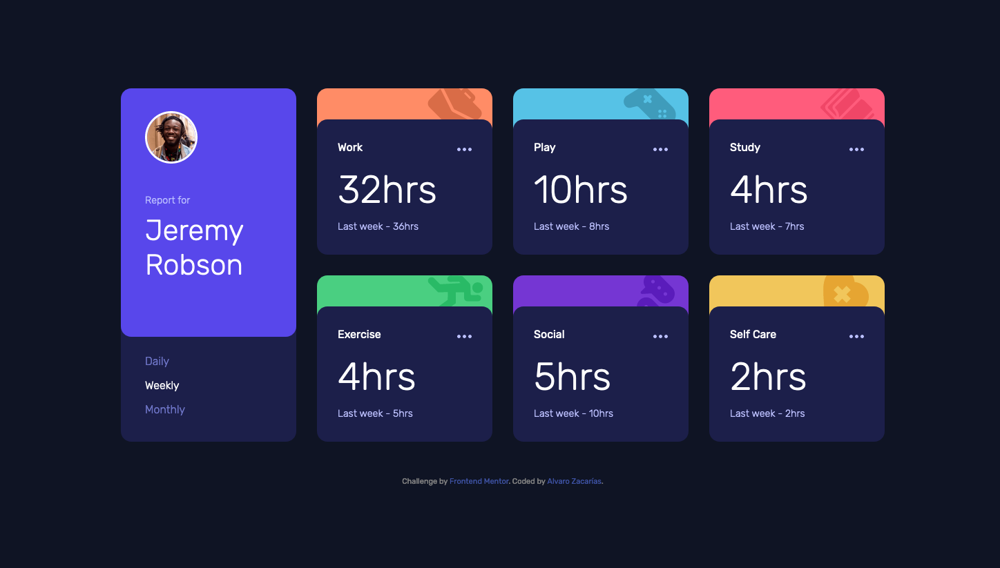
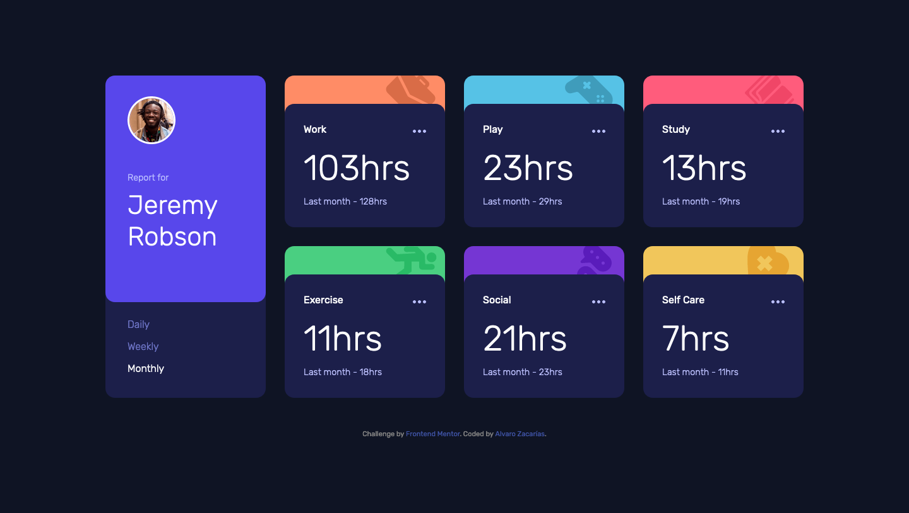

# Frontend Mentor - Time tracking dashboard solution

This is a solution to the [Time tracking dashboard challenge on Frontend Mentor](https://www.frontendmentor.io/challenges/time-tracking-dashboard-UIQ7167Jw). Frontend Mentor challenges help you improve your coding skills by building realistic projects. 

## Table of contents

- [Overview](#overview)
  - [The challenge](#the-challenge)
  - [Screenshot](#screenshot)
  - [Links](#links)
- [My process](#my-process)
  - [Built with](#built-with)
  - [What I learned](#what-i-learned)
  - [Continued development](#continued-development)
  - [Useful resources](#useful-resources)
- [Author](#author)
- [Acknowledgments](#acknowledgments)

## Overview

### The challenge

Users should be able to:

- View the optimal layout for the site depending on their device's screen size
- See hover states for all interactive elements on the page
- Switch between viewing Daily, Weekly, and Monthly stats

### Screenshot

### Links

- Solution URL: [https://github.com/alvarozama/Time-tracking-dashboard]
- Live Site URL: [https://alvarozama.github.io/Time-tracking-dashboard/]

## My process

### Built with

- Semantic HTML5 markup
- CSS custom properties
- Flexbox
- CSS Grid
- javaScript

### What I learned

Most of all, this challenge helped me learn how to work with data from JSON. However, even though I managed to make my code work using the data from the JSON file provided, there are a few thing I feel like I'm missing.

### Continued development

I used the fetch API, but I feel like my fetch statement is somewhat botched, so despite having made my code work, I'd like to further look into the workings of fetch, as well as the handling of errors with it. 

### Useful resources

- [https://www.geeksforgeeks.org/read-json-file-using-javascript/] - This helped me for XYZ reason. I really liked this pattern and will use it going forward.
- [https://www.freecodecamp.org/news/how-to-read-json-file-in-javascript/] - This is an amazing article which helped me finally understand XYZ. I'd recommend it to anyone still learning this concept.

## Author

- Frontend Mentor - [@alvarozama](https://www.frontendmentor.io/profile/alvarozama)

